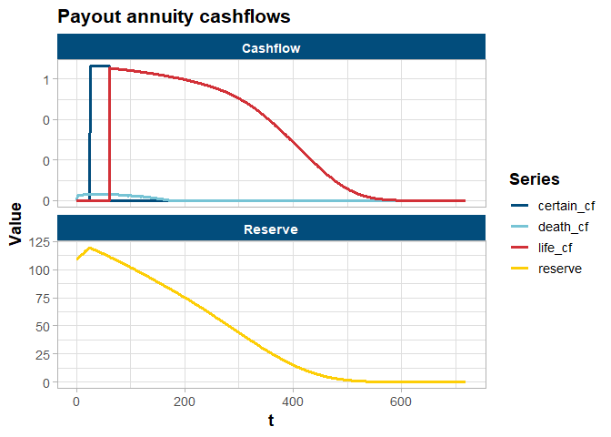

# ACHSproj

Companion package for the ACHS Spring 2026 talk. It provides tools for
projecting payout annuity cashflows, computing present values and IRRs,
and visualising results — all built on S7 classes and the
vctrs/tidyverse ecosystem.

## Projecting a payout annuity

`annuity_cf()` is the core function. It builds a monthly projection for
a deferred, life-contingent payout annuity and returns a `projection`
object whose `@data` tibble contains mortality, cashflow, and reserve
columns.

Key assumptions in this projection:

- Mortality follows the 2012 Individual Annuity Mortality Basic table
- Mortality improvement follows Projection Scale G2 with improvements
  from 2012
- A single deterministic discount rate
- Monthly cashflows

``` r
p <- annuity_cf(
  issue_age    = 60,
  benefit      = 8,       # annual benefit amount
  premium      = 100,     # single premium at time 0
  defer_years  = 2L,      # 2-year deferral period
  certain_years = 3L,     # 3-year certain period
  refund       = TRUE,    # return-of-premium death benefit
  disc         = 0.05,    # annual discount rate
  start_date   = "2026-05-06"
)

p
#> <projection>
#> @freq: 12
#> @gender: Female
#> @defer_years: 2
#> @certain_years: 3
#> @life_contingent: TRUE
#> @refund: TRUE
#> @data:
#> # A tibble: 721 × 17
#>        t date       pol_yr   age years_imp      qx    mi  qx_adj   tpx  premium
#>    <dbl> <date>      <dbl> <int>     <dbl>   <dbl> <dbl>   <dbl> <dbl> <cf<mo>>
#>  1     0 2026-05-06      0    60        14 0.00384 0.013 0.00320 1          100
#>  2     1 2026-06-06      1    60        14 0.00384 0.013 0.00320 1.00         0
#>  3     2 2026-07-06      1    60        14 0.00384 0.013 0.00320 0.999        0
#>  4     3 2026-08-06      1    60        14 0.00384 0.013 0.00320 0.999        0
#>  5     4 2026-09-06      1    60        14 0.00384 0.013 0.00320 0.999        0
#>  6     5 2026-10-06      1    60        14 0.00384 0.013 0.00320 0.999        0
#>  7     6 2026-11-06      1    60        14 0.00384 0.013 0.00320 0.998        0
#>  8     7 2026-12-06      1    60        14 0.00384 0.013 0.00320 0.998        0
#>  9     8 2027-01-06      1    60        15 0.00384 0.013 0.00316 0.998        0
#> 10     9 2027-02-06      1    60        15 0.00384 0.013 0.00316 0.998        0
#> # ℹ 711 more rows
#> # ℹ 7 more variables: certain_cf <cf<mo>>, life_cf <cf<mo>>, hist_pay <dbl>,
#> #   death_cf <cf<mo>>, total_cf <cf<mo>>, disc <dbl>, reserve <dbl>
```

Key columns in `p@data`:

| Column       | Description                                                 |
|--------------|-------------------------------------------------------------|
| `tpx`        | Cumulative survival probability from time 0                 |
| `premium`    | Single premium inflow at time 0                             |
| `certain_cf` | Guaranteed benefit payments during the certain period       |
| `life_cf`    | Life-contingent benefit payments after the certain period   |
| `death_cf`   | Return-of-premium death benefit (when `refund = TRUE`)      |
| `total_cf`   | Sum of all cashflows                                        |
| `reserve`    | Prospective reserve — PV of future cashflows at each period |

**NOTE:** The `reserve` column is for illustrative purposes only and is
not meant to represent a realistic reserve that would be held under any
particular regulatory regime.

## Support functions

### `pv()` — present value

`pv()` works on both plain numeric vectors and `projection` objects.

``` r
# PV of a simple cash flow stream: invest 100 today, receive 110 in one year
pv(c(-100, 110), disc = 0.05, freq = 1L)
#> [1] 4.761905
```

On a `projection`, it returns a tibble of present values for every
`cf_vec` column, discounted at the stored rate by default.

``` r
pv(p)
#> # A tibble: 1 × 5
#>   premium certain_cf life_cf death_cf total_cf
#>     <dbl>      <dbl>   <dbl>    <dbl>    <dbl>
#> 1     100      -20.1   -86.1    -3.05    -9.18
```

The `rolling = TRUE` option returns the prospective reserve at every
time step — that is, the PV of cashflows still to come, discounted back
to that moment. This is what populates the `reserve` column
automatically.

``` r
head(pv(p, rolling = TRUE)$total_cf, 10)
#>  [1] -109.1809 -109.5990 -110.0188 -110.4404 -110.8636 -111.2886 -111.7154
#>  [8] -112.1438 -112.5741 -113.0064
```

### `irr()` — internal rate of return

`irr()` finds the discount rate at which the PV of a cashflow stream is
zero.

``` r
# Invest 100, receive 110 in one year — IRR should be 10%
irr(c(-100, 110), freq = 1L)
#> [1] 0.1
```

On a `projection`, `irr()` operates on `total_cf` and returns the **cost
of funds** — the rate at which the insurer breaks even on the contract.

``` r
irr(p)
#> [1] 0.05716129
```

### `plot()` — cashflow and reserve chart

`plot()` produces a two-panel chart: the top panel shows the cashflow
components over time, and the bottom panel shows the prospective
reserve.

``` r
plot(p)
```


